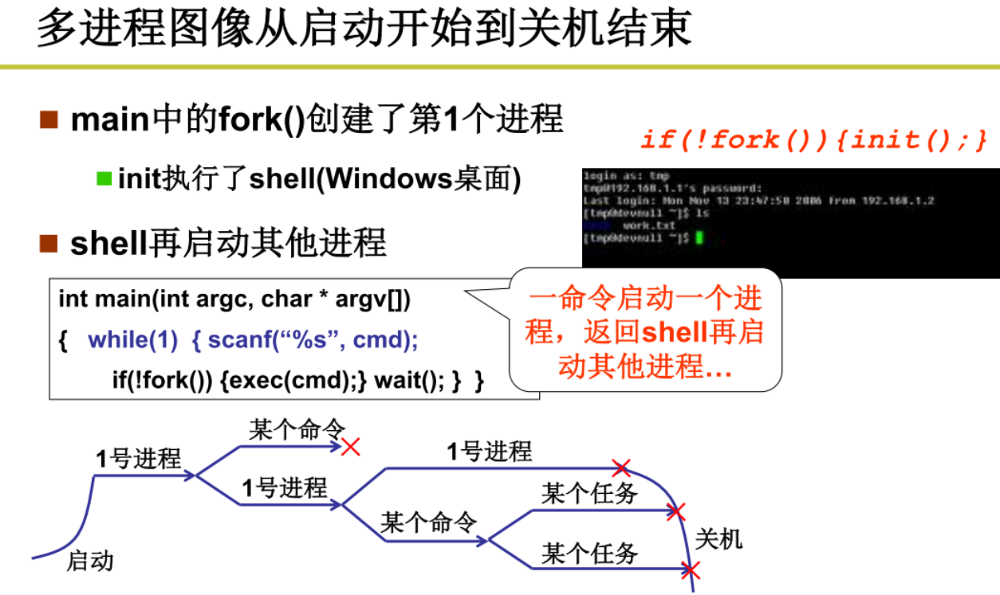
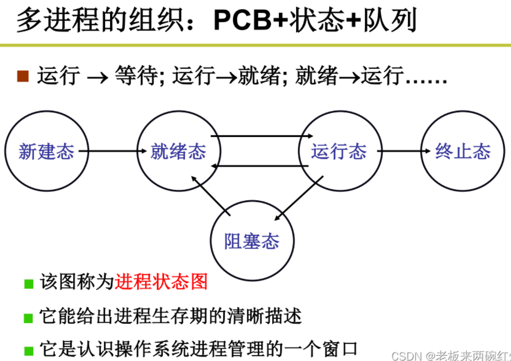
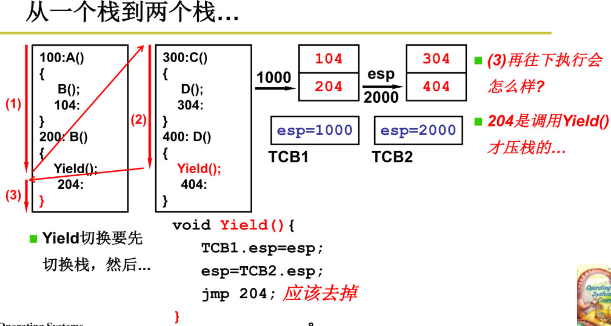
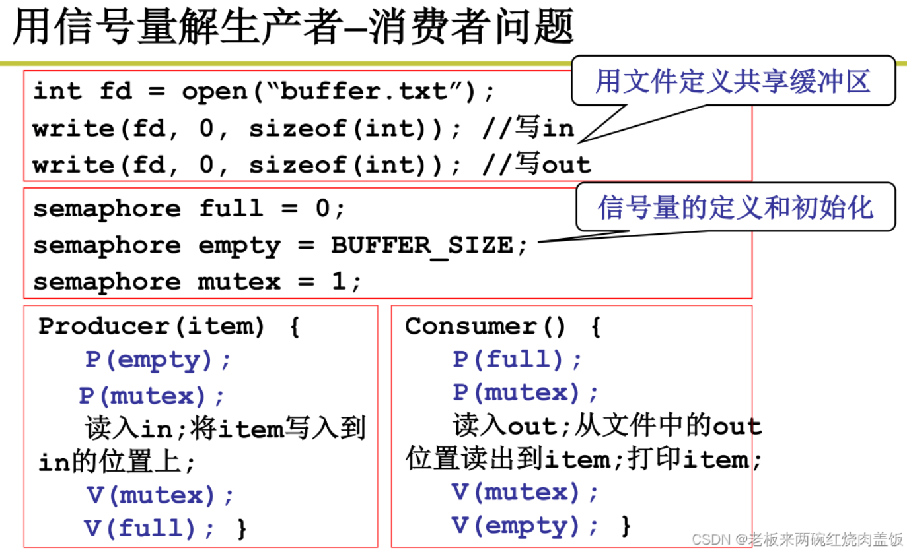
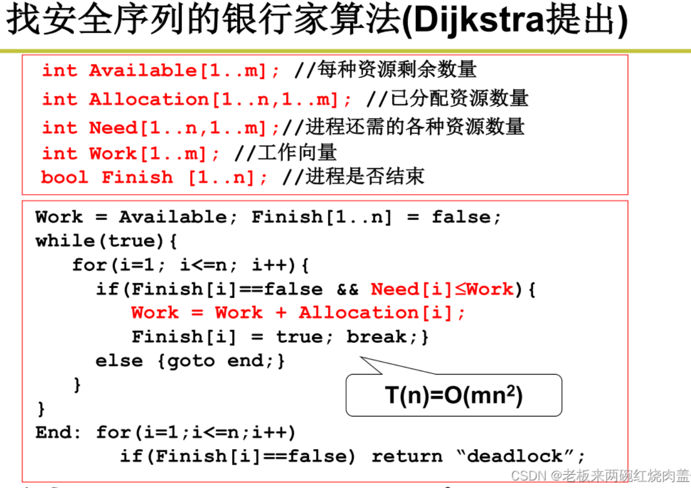

#操作系统
>[操作系统 李治军 网课](https://www.cnblogs.com/Baiyug/p/16544906.html)

>[笔记参考](https://blog.csdn.net/weixin_44673253/category_12014667.html?spm=1001.2014.3001.5482)

>[linux源码解析](https://www.cnblogs.com/Baiyug/p/16526902.html)

---
##1.2 载入操作系统
操作系统后做的第一件事

* BIOS即是base input output system，BIOS代码本来存储在ROM中，其中较为重要的一部分代码复制到内存地址为0xF0000开始的ROM BIOS映射区上，剩下一部分复制到内存的最末端
* 一个扇区为512B
* 0磁道0扇区是操作系统的引导扇区
* 启动顺序通常是这样的：
  * 电源启动： 当你按下电源按钮时，计算机的电源开始供电。
  * 自检（POST）： BIOS进行自检，检查计算机硬件是否正常工作。如果有问题，系统可能会发出蜂鸣声或在屏幕上显示错误信息。
  * 硬件初始化： BIOS初始化与主板、处理器、内存等硬件相关的基本设置。
  * 引导程序加载： BIOS会尝试从预定义的启动设备（通常是硬盘、固态硬盘或其他存储设备）中加载引导程序（bootsect.s）。
  * 引导操作系统： 引导程序负责加载操作系统的核心部分，将控制权交给操作系统。
  * 操作系统启动： 操作系统接管控制权，开始运行，同时显示启动画面或登录界面。

* 将操作系统载入到内存里，才可执行程序代码，==bootsect.s==代码即引导扇区代码，就是完成把整个操作系统载入到内存里，下面即是此代码的执行步骤

1. 开始运行引导扇区控制程序

* 上述0x07c0：0x0000处存储的代码，也是操作系统开启后运行的第一段代码
* DS、ES、SI、DI寄存器
  *  物理地址 = 段地址 x 16 + 偏移地址
  *  DS和ES是段寄存器（存储段地址），SI和DI是索引寄存器（存储偏移地址）
  *  DS:SI和ES:DI配对时通常用来执行一些字符串操作
  *  上述我们可以得到两个物理地址，即0x7c00，0x90000，分别存储在DS:SI和ES:DI中
> | 常用寄存器 | 英文全称 | 段寄存器 | 英文全称|
> |:-:|:-:|:-:|:-:|
> |ax|accumulator|cs|code section|
> |bx|base address register|ds|data section|
> |cx|counter|es|extern section|
> |dx|data register|ss|stack section|
> |si|source index|ip|instruction pointer|
> |di|destination index|
> |sp|stack pointer|
> |bp|base pointer|
* CX寄存器
  *  为计数寄存器，在循环、串操作指令中用作计数器，这里存储的是256
  *  rep指令->重复执行，直到cx = 0，movw指令->移动1个字，这里就是重复移动字256次，256个字正好就是512B
  *  刚好把将0x07c0:0x0000处的256个字移动到0x9000:0x0000处，目的是腾出空间，0x07c0:0x0000之后有其他用处
* jmpi->段间跳转，CS=INITSEG，IP=go，CS+IP即为物理地址
1. 读取磁盘setup扇区

* 要读取磁盘扇区，肯定需要BIOS提供的中断指令和提供磁盘的相关信息（柱面号，磁头号等信息），0x13就是其中一个扇区中断
* 前面的引导扇区代码执行完成后，boot扇区的起始地址从0x7c00变为0x90000，而一个扇区是512字节，对应16进制就是0x0200；所以0x9000:0x2000就是指向setup的4个扇区中的第一个扇区。而通过对上面汇编代码的部分注释可以看到 ES = 0X9000，BX = 0x0200，所以刚好是指向下图中setup的4个扇区中的第一个扇区
* jnc->跳转指令，当CF=1时则跳转到ok_load_setup代码段
1. 显示loading字样

* BIOS 提供的 int 0x10 是用来显示字符的，显示的内容为：loading system ...
  * 相当于windows系统里的loading界面
* 如果你要显示你想要的字符，先修改msg1的内容分，然后记得把代码中==cx, #24==改成你的字符数
* 读入system模块
* jmpi->跳转指令，这里是跳转到setup扇区执行里面的程序——==setup.s==，来启动操作系统

>载入系统模块: boot模块 -> setup模块 -> system模块

##1.3 操作系统启动
###下面将执行setup.s
1. 将system模块复制到内存首部

* 获取内存大小：mov [2], ax 将 ax 中内容传递至内存地址 ds : [2] 处即 0 x 90002处, ax中保存的值为调用int 0x15中断后获取的扩展内存大小（对于linux 0.11版本内存为1mb）
* 将system模块内容存到内存首部：bootsect代码首先会将自身从0x07c0:0x0000处移动到0x9000:0x0000处，接下来读入的setup模块也紧跟在移动后的bootsect代码后，这么做就是为了给system模块放在0x0000~0x8000腾出空间
  *  ds : si 为 0x10000 ；es : di 为 0x00000
> 
2. 启动保护模式

* jmpi 0,8：ip指针跳到cs为8，ip为0的位置，也就是1000（二进制）左移四位，再加上0000（二进制），也就是0x80（二进制为1000 0000）
  *  但是跳到80是个非法指令，跳到80的地方，后果就是死机，所以不该跳到80
  * CS和IP都是16位的寄存器，CS<<4+IP最多能够达到20位地址，也就是1M的地址空间，1M肯定是不够的，无法满足现代计算机的要求，现在要从1M变成4G，即32位模式。从16位模式切换到32位模式，即切换保护模式
* mov cr0,ax：通过对cr0的OE置1来启动保护模式
  * PE=1表示启动保护模式，PE=0则还是原来的16位实模式，PG=1表示启动分页
> 全局描述符表 Global Descriptor Table(GDT)
> 
> * GDT产生32位地址
> * 以前时候，CS当中就是放的段基址，左移四位加上IP就是地址，但是现在CS当中放的是查表的索引，成为了一个选择子，也就是看CS中的内容是多少，然后找到表中对应索引项中的数值
> * jmpi 0, 8这条指令，CS=8，所以从表中，找到索引为8的内容，从当中取出基址，再加上偏移地址，组成地址
> 
> * lidt idt_48 表示把idt_48放在 idtr 寄存器中
> * lgdt gdt_48 表示把gdt_48放在 gdtr 寄存器中
> * gdt 这个标签处，就是全局描述符表在内存中的真正数据
> 
3. jmpi 0,8

* CS = 8相当于在gdt中找偏移8个字节的值，也就是0x07FF（注意一开始的0，0，0，0只占了8个字节，也就是2个字，而不是占了4个字，后面的才是占了4个字）
* 每4个字为一个段描述符，在CS = 8时是0x07ff,0x0000,0x9a00,0x00c0这四个字，将这四个依次填到GDT表项中，可以看到表项中的有关段基址组合起来的是0x00000000，就是基地址，由于ip = 0，所以最终的地址也是0x00000000
* 所以setup.s代码最后执行的就是将指令IP跳到0x00000000处
###下面将执行head.s
1. 再次初始化IDT和GDT表

> head.s的代码和之前看到的bootsect.s和setup.s的代码不太一样，这是因为head.s是运行在保护模式(32位模式)下的，是32位的汇编代码，而bootsect.s和setup.s的代码是16位的汇编代码，另外在c代码中，可以内嵌汇编，达到精细控制的目的，这又是另外一种汇编
> 
2. 转到main.c程序

* pushl入栈操作，用于为调用/init/main.c 程序和返回作准备，现将三个main的参数——三个0压入栈
* pushl $L6入栈操作是模拟调用 main.c 程序时首先将返回地址入栈的操作，所以如果 main.c 程序真的退出时，就会返回到这里的标号L6 处继续执行下去，也即死循环
* pushl $_main将 main.c 的地址压入堆栈，这样，在设置分页处理（setup_paging）结束后执行'ret'返回指令时就会将 main.c 程序的地址弹出堆栈，并去执行 main.c 程序去了
> 图上的栈的顶是在下面，从上到下依次为0、0、0、L6和main
###下面将执行main.c

* 以mem_init为例

  * 按照4K为单位对内存进行划分区域，mem_map是表示内存区域是否被使用的一个表格
  * end_mem其实就是总内存大小，从0x90002的位置来的
  * 首先将mem_map全部初始化为USED，然后将start_mem到end_mem之间的内存区域设置为0，即未被使用
  * mem_map前面的部分是USED，这是操作系统代码和一些管理硬件的数据结构所占用的内存

==总的来说：bootsect（将OS从磁盘读进来），setup（获得参数，启动保护模式），head（初始化GDT表，页表），main（一堆mem_init之类的，看有哪些空闲内存之类的，看内存的分配情况），合在一起，就是在启动时候做了两件事，分别是读入  内存  和  初始化==
##1.4 操作系统接口
操作系统接口即是能够调用操作系统的一些重要函数，即系统调用（system_call）
1. 三种主要的接口形式

2. 命令行接口

* C++程序---通过gcc编译后--->可执行文件---在命令行中输入此可执行文件--->shell中通过exec函数开始执行此可执行文件
* shell本身也是一段程序，它的代码很简单，就是一个死循环，不断的读入命令并执行
3. 图形按钮接口

* 当鼠标点击、键盘按下后，通过中断，这一事件被放到消息队列中
* 操作系统的内核中，有一个应用程序会不断的从这个消息队列中取出并处理这些事件，处理事件的代码中，就有对操作系统接口的调用
4. 操作系统的接口即是系统调用

##1.5 系统调用的实现

* APP在内存中，OS也在内存中，但APP想访问OS提供的内容不能直接进行呢（不能直接jmp或者直接mov访问OS中的数据）——因为OS当中有很多很重要的东西，比如rootroot用户的密码，所以用户程序能够直接取出OS中的数据会造成不安全的隐患

* 为了保障操作系统中如用户信息、密码等重要信息的安全，引入了内核态和用户态
* 内核态可以问任何数据，用户态不能访问内核数据，对于指令跳转也是一样
* CPL是当前程序的特权级，表现为CS的最低两位，DPL是目标内存段的特权级，可以从GDT表中查到，在保护模式下指令地址的翻译是查GDT表，那么这个时候就可以查到目标指令的DPL，然后和当前态的特权级CPL比较，如果DPL>=CPL,那就说明当前态的特权级足以执行目标指令，否则就不允许执行
###从用户态到内核态的过程

* 以C代码库编写的系统调用printf为例，在用户程序调用后，会首先进入C代码库函数，然后用汇编代码在约定的位置（栈或者寄存器)设置参数和系统调用编号，最后执行int指令。
1. write函数和_syscall3函数

* 对于write函数中调用的_syscall3函数，其输入参数分别为type=int，name=write...
* 获取_NR_write,这是write的系统调用编号，将它放在eax寄存器中，参数放在ebX、ecx、edx中
* 然后执行int0x80指令，这个中断执行后，会把返回值放在eax寄存器中
* eax寄存器的值会赋给res,最终返回res
2. int 0x80中断 —— 用户态访问内核态唯一的方式

* sched_init函数是操作系统初始化时候的函数，其中有一个函数set_system_gate是用来设置中断表项的函数，当其参数为0x80和system_call就是说是设置中断0x80的，其中0x80的中断处理函数的地址就是system_call函数的地址，system_call函数也就是系统调用函数
* 在set_system_gate函数中，n=0x80，addr=&system_call，在set_system_gate函数中又定义了一个函数_set_gate，其中gate_addr=&idt[n]，type=15，dpl=3，addr=&system_call
* 在_set_gate函数中，ds=es=0x10,表示将数据段置为内核的数据段地址，也就是在段选择符中填入0x10，然后把DPL中填入3，把addr填入分为两段的处理函数入口点偏移中，那么CS=段选择符，IP=两段的处理函数入口点偏移的拼接，便可由CS:IP获取到system_call在内存中存储的位置
* ==由于system_call函数对应的中断表项中DPL=3，而用户自己调用的printf函数的CPL=3，那么DPL=CPL，则用户函数可以调用出内核函数，用户函数就是借助这样的在中断表项中强行填入3来实现对内核的访问==
3. system_call函数——int 0x80的中断处理函数

* call _sys_call_table(, %eax, 4)相当于在_sys_call_table中查取编号为4的那个函数，也就是之前在write中输入的参数write，它经过__NR_write得到编号为4，那么现在就是从_sys_call_table中找到编号为4的那个函数，也就是真正的系统printf函数——sys_write

###总体思路

##1.6 操作系统的历史
###Linux时间线

* 多道程序
* 作业之间的切换和调度称为核心，因为既有IO任务，又有计算任务，需要让CPU忙碌（如果还是按照之前的批处理操作系统，那么必须执行完IO任务后，才能执行计算任务，CPU在IO任务执行的这段时间内就是空闲的)

* 可同时多个人使用一台电脑，利用分时系统，每个人可以使用到一个时间段的一小截

###DOS和MAC OS时间线

* 这里的DOS是disk operation system

##2.1 CPU管理的直观想法

* 程序自动执行的重点是设置好PC的初始位置，从而执行完一条命令后PC会自动加1，进而执行下一条指令
* 为了提高CPU的利用率，我们不能在等待外设数据的时候（如执行IO指定printf时）让CPU也保持等待，此时PC指针可以跳转到其他地方，从而利用这段原本等待的时间去执行其他的程序，从而提高CPU利用率，这就是==并发==的思想

* 为了在并发的时候，PC跳转回原本的程序的时候ax、bx等里面的数据恢复，需要在跳转前记录这些数据

##2.2 多进程图像

* 上图中有三个进程（PID），每个进程都对应一个PCB，其中记录了这个进程的数据

* main初始化之后，执行了一堆init的函数之后，启动了一个进程，if (!fork()) {init();}，fork()创建了第一个进程：shell（对于linux），是初始化进程，shell再启动其他的进程，windows则是创建个图形交互界面，之后再执行其他进程
* 之后再shell里面输入命令后，main函数中会调用scanf输入这些命令，然后开启一个新的进程（fork），之后再执行此进程（exec）

1. 多进程的组织

* 操作系统感知进程，全靠PCB(prcess control block)，组织进程也是全靠PCB，用PCB形成一些数据结构，里面存储着一个进程的绝大部分信息，包括寄存器数据状态的存储，所以说计算机组织好多进程才能管理好多进程，就是用PCB这个结构体形成一堆数据结构，就出现了队列这个数据结构
* 就绪队列：有多个进程，有一个进程正在执行
* 等待队列：缺事件的进程，即使排到了也得继续等待事件
* 把进程根据状态进行区分

* 用PCB放在不同的队列中，用状态来推进这多个进程，进行状态转化，这就是操作系统进行多进程的组织过程

2. 多进程的交替

所谓多进程的交替，就是进程的不断的切换，这是最核心的东西，如果不能这样交替切换，多进程就没有意义了，就变成单道批处理了

* schedule()，getNext()函数是重点，即切换和调度
* getNext()从就绪队列中挑出下一个占用CPU的进程
* switch_to()就是用PCB进行进程上下文的切换，pCur、pNew分别指当前进程的PCB和调度得到的下一个进程的PCB，因为操作系统都是根据PCB来感知一个进程
* 选好了就完成具体的切换，因为PCB都保存了当时的信息（现场信息），所以能进行切换
* 交替的三个部分:队列操作+调度+切换

* 调度就是进程的切换，你已经找到了下一个进程了，就要切换下一个进程
* 调度的策略最基本的是上述两种，实际系统的调度往往复杂得多

* 首先会把当时的信息记录下来，到PCB当中保存现场，将当前CPU的各种信息（寄存器等）保存到pCur中，将pNew中的寄存器等信息恢复到CPU中

3. 多进程的互斥

* 多个进程同时存在会相互影响，例如会发生内存地址的冲突
* 一个进程原则上不能随意访问另一个进程的内存
* 多进程的地址空间分离：内存管理的主要内容，也就是说，多进程图像需要完成对内存的管理

* 解决方法：内存映射
* 虚拟内存技术：两个进程的100内存地址，是虚拟内存地址，会映射到不同的物理内存

4. 多进程的合作

* 对共享数据的操作会引发问题，例如counter如果不加以保护，其最终结果很可能不符合预期，比如某生产者程序的counter还没加一，就被切换到消费者程序对counter进行减一，所以要解决的问题是防止某数据在没有被处理完成之前，又被其他进程进行处理
* 所以多进程合作，需要注意共享数据的正确性，核心在于进程同步
* 例如在一个进程写counter时，需要阻断其他进程访问counter

* 锁机制，用于保护共享数据counter

5. 总结

##2.3 用户级线程

* 进程拥有不同的内存映射表，而线程共享同一个内存空间，不改变内存映射表，只改变指令指针，故一个进程中可包含多个线程
* 线程的切换是指令的切换，学习完线程后再加上内存切换的部分，就是进程

* 以打开网页浏览器为例，浏览器是一个进程，其中有许多线程，包括接受数据、显示文本、显示图片等线程
* 为了让用户更快看到信息，在接收完文本的数据后可立即显示文本内容，之后再接着接收图片，再显示图片，这就是线程的切换过程

* 使用pthread_create创建两个线程
* 线程GetData用于从服务器获取数据，线程Show用于显示数据
* 使用Create函数初始化线程环境，使用Yield函数切换线程

####遇到的第一个问题

* 栈最下面为栈顶
* 两个方框代表两个线程，每个线程中又含有两个函数
* 当使用一个栈来存储函数返回地址时，从函数A进入函数B时，将104压入栈，接着转到函数B，在函数B遇到线程切换函数Yield后，接着将204压入栈，切换到另一个线程（转到300执行）,执行函数C，函数C中进入函数D前，会把304压入栈，在函数D中又调用Yield函数，接着将404压入栈，跳回到函数B里面的204
* 问题出现了：执行完204后，遇到了右大括号，表明需要return了，而return必须从栈中弹出栈顶的404，将指令指针赋为404，这时候又回到404执行？显然这不是我们希望的，我们希望的的是指令指针为104，那样的话就会回到函数A执行剩下的内容
* 解决方法为：==每一个线程使用一个不同的栈==

####遇到的第二个问题

* 在使用两个栈后，之前的问题得到解决，但是出现了新的问题，那就是在函数D中调用Yield后，指令指针跳回到204继续执行，执行完后，我们希望的是回到104继续执行，但是现在第一个线程所对应的栈的栈顶元素是204，照这样下去指令指针又会跳回到204执行
* 解决方法为：==将Yield函数里面的jmp指令去掉==，这样的话，遇到右大括号，也是会return，从而将第一个栈的204出栈，进而执行204指令，之后函数B中也会遇到右大括号，又会将第一个栈中的104出栈，从而又执行104的指令
* TCB（thread control block）与PCB相似，其功能为存储线程的状态和相关数据

* 上图的ThreadCreate就是Create函数，完成了分配TCB、分配栈、栈顶压入线程的初始地址、TCB中保存栈顶指针、Create返回的时候，从栈里弹出的地址就是线程的初始地址的工作

####用户级和内核级线程

* yield是用户程序，完全没有进入内核,这是并发（线程同时产生，线程交替执行），与内核级线程的并行（线程同时执行）不同
* 缺点举例：在浏览器获取数据的函数GetData中，等待网络IO阻塞（这是内核级别的阻塞），因为操作系统完全不知道还有用户级线程的存在，所以不会线程切换到展示数据的函数Show，而是直接在内核中进行了进程的调度与切换（切换到了浏览器进程之外的别的进程)

* 按照老师的意思，这里核心级线程的ThreadCreate和用户级线程的ThreadCreate是两个不同的函数
* 核心级线程的ThreadCreate是系统调用，会进入内核
* 内核级线程不再能由用户主动yield，而是由操作系统自动调度

##2.4 内核级线程

* 多核与多处理器的区别：多处理器每个CPU有自己的一套缓存寄存器（Cache）和映射（MMU），多核多个执行序列共用一套缓存寄存器（Cache）和映射（MMU），由于多核中共用一个内存，这也符合了线程共享内存的特征，而且每个核负责执行一个内核级线程，故多核中多个内核级线程可以同时进行，与用户级线程交替进行（无法同时进行）不同
* 并发——有处理多个任务的能力，但不同时执行
* 并行——有处理多个任务的能力，且同时执行
* 故用户级线程属于并发不属于并行，内核级线程属于并属于并发

* 用户级线程是每一个线程都有自己的一个栈，内核级线程是每一个线程都有自己的一套栈，其中包含有内核栈和用户栈
* 进入内核态，创建内核级线程，这就需要内核栈；但是回到用户态，也可以创建线程，这就是用户栈
* 用户级线程切换：根据TCB切，然后根据TCB切换用户栈
* 内核级线程切换：根据TCB来切换一套栈，内核栈要切，用户栈也要切

* 一旦有了中断，int，键盘鼠标之类的都会引起用户栈到内核栈的切换
* 从用户态进入内核态时(INT中断指令)，需要在内核栈中先依次压入源SS、源SP、EFLAGS、源PC、源CS等内容
* 源SS和源SP是指向用户栈地址的指针，也就是说内核栈中存放了指向用户栈的指针
* 源PC和源CS是用户栈中的返回指令地址
* CS（Code Segment）：代码段寄存器
* DS（Data Segment）：数据段寄存器
* SS（Stack Segment）：堆栈段寄存器
* SP（Stack Pointer ）：栈指针
* 从内核态返回用户态的时候(IRET中断返回指令)，会从内核栈弹出这些信息，根据这些信息就可以恢复到用户栈，例如根据内核栈弹出的CS:PC继续执行用户级线程接下来的指令

* 首先在用户级线程中执行函数A，在函数A中调用了函数B，故需将104压入用户栈，接着执行函数B里的read函数，此时也需要将204压入用户栈，接着执行read函数，由于在read函数中产生了中断int，故进入了操作系统的内核，产生了一个新的内核级线程
* 进入内核级线程的第一件事是把上述的用户级线程的相关信息压入内核栈，包括用户栈的地址，用户级线程的返回指令地址（在这里是304），CS，1000（里面包含中断返回指令地址iret）
* 接着就被call到执行函数sys_read，正式进行内核级线程

* 由于上述内核级线程中的sys_read要读取磁盘，会阻塞一段时间，为了提高核的利用率，这时候可以切到其他的内核级线程继续执行一段时间，这个就是内核级线程的切换——使用同一个核下的线程的交替进行
* switch_to：阻塞后找到下一个线程，next表示下一个线程的TCB，cur表示当前线程的TCB
* 在进入switch_to()之前，将S的返回地址压入S的内核栈中
* 切换TCB(TCBcur:=物理寄存器esp,物理寄存器esp=TCBnext)
* switch to()结束，则从T的内核栈中弹出一个地址，并跳转到这个地址，去执行T的内核代码
* 接着，T的内核代码不断运行，伴随着一些栈的操作，直到碰到IRET指令，这个时候就弹出内核栈中的CS:IP切换回线程T的用户程序（用户态），根据SS:SP切换回用户栈

##2.5 内核级线程的实现

* fork函数的作用是创建一个新的==进程==，调用 fork 函数的进程为父进程，新生成的进程为子进程
* 为什么讲fork系统调用：一方面，因为fork是创建进程的系统调用，包括创建资源和指令序列（线程），也就是说能看到创建线程的过程；另一方面，也能看到进程/线程调度与切换的过程（五段论）
* 首先调用main，将返回地址exit压入用户栈，因为中断完成后肯定要返回；然后main函数中，首先调用A，将返回地址B压入用户栈；接下来进入A函数，就是一个fork函数的调用，fork函数展开成汇编代码
  *   首先将_NR_fork（系统调用），即fork系统调用的编号放入eax寄存器
  *   然后就是int 0x80中断指令，开始做进入内核态的准备工作——内核栈中压入SS:SP，执行的时候指向用户栈；内核栈中压入fork里的int 0x80的下一个代码的地址，即int中断指令的下一条；int 0x80对应的是系统调用，开始执行中断处理函数_system_call的代码，且把_system_call的地址压入栈

###中断入口和中断出口（用户态->内核态和内核态->用户态）

* 进入_system_call后还要把一堆用户级线程中的寄存器数据等压入内核栈，保护现场，接着根据_sys_call_table调出sys_fork函数
* 调用sys_fork（可能会引起切换），真正进入内核态
* 老师跳过了sys_fork的功能性代码（即创建==进程==的过程，这个在本视频的后半段再讲），直接来到其最后判断是否需要调度/切换的代码
* 在sys_fork的功能性代码执行完后，会判断当前线程（进程）的状态是否阻塞（第一个cmpl），当前线程的时间片是否已经用完（第二个cmpl），任何一个满足，就跳转到reschedule，即切换线程（进程）
* 在reschedule函数中，首先将ret_from_sys_call入栈，然后调用进程调度c函数schedule，在schedule函数运行到最后的右括号时，就会从栈中弹出指令地址ret_from_sys_call，继续执行sys_fork函数剩余的内容

* 中断入口_system_call一开始两段代码是一堆的push保护现场，中断出口ret_from_sys_call后是一堆的pop恢复现场
* 接着使用iret从内核态重新回到用户态，接着执行INT 0x80后面的指令

###线程（进程）的切换

* 在schedule函数中调用switch_to函数进行切换，其中的next就是计划切换到线程（进程）
* switch_to在linux0.11（没有实现内核栈的切换）中，切换方案是TSS（Task Struct Segment）实现方案，用这种方法进行切换，可以认为保存了所有寄存器的信息，也可以认为是TCB(PCB)的一部分信息
* 在windows中用的并不是TSS这种切换方法，而是像上一讲说的那种内核栈切换方案，在这里先用TSS实现切换，实验4会改用内核栈切换方案
* TSS是一个段，必然有一个描述符（指向段的指针），有描述符就有选择子
* 选择子是TR，TR是操作系统固有的一个寄存器，和cs一样是固有的，TR就是用来找到这个段的，所以用TR这个选择子找到描述符之后再找到这个段，这就是找到了TSS段
* 新的TR，就是TSS(n)，就是下一个进程对应的cs
* 长挑转指令的整个过程:把当前CPU的所有寄存器信息（快照，保存现场）放在当前TR对应的原TSS，将新的TR对应的新TSS中的信息赋给CPU的寄存器等（恢复现场）
* TSS切换的实现比较简单（实际上代码只是一句ljmp %0\n\t），但是效率较低（这种方案因为TSS保存了很多东西，所以切换很慢（保存现场和恢复现场的过程很慢），只用ljmp一条指令完成，这条指令就会做得很复杂，一条指令也不能通过指令流水来优化，不能充分利用CPU的硬件加速）

###创建子进程（新进程）

与新线程的创建相似，只是多了内存部分，会进程的创建的视线自然就会线程的创建的实现

* fork实际上是linux中创建子进程的一种方式，创建子进程，每个进程有一个主线程，那么实际上也就是创建了一个新的线程，所以可以通过sys_fork来看CreateThread
* sys_fork中调用了_copy_process，需要一大堆参数，这些参数已经被提前放到当前这个父进程的内核栈里面了（call _copy_process指令之前的那一堆push、pushl指令），调用时就会倒序从栈里取出参数（为什么需要这么多参数？别忘了fork是按照父进程copy出一个子进程，所以这些参数基本上都是来自父进程的，子进程按照这些参数来创建）
* 栈里的ret=??1对应参数long eip，也就是int 0x80的下一条指令的地址作为返回地址
* ??4 就是call _copy_process的时候的PC，对应指令addl $20, %esp
* ??2 就是call _sys_fork的时候的PC，翻到上面的图可以看到，对应的指令是pushl %eax
* 右侧将内核栈分成了左右两部分，左部分的内容是从进入int 0x80中断到call _sys_fork之前就准备好的，右部分的内容是进入_sys_fork后才准备的参数

* 用户栈、内核栈是TSS的一部分（或者说是关联），TSS是TCB（PCB）的一部分
* 首先调用get_free_page()分配一页内存，并且类型转化为task_struct（可以理解为PCB，其中包含了一个子结构TSS）：即申请内存空间+创建TCB（PCB）
* p->tss.esp0是内核栈的栈顶指针，设置为PAGE_SIZE（4k）+p，即这一页的最后一个地址
* p->tss.ss0是内核栈的段地址，0x10是内核数据段
* p->tss.esp和p->tss.ss是用户栈，这里由参数ss和esp指定，也就是说，和父进程共享用户栈

* p->tss.eip=传入的eip，也就是说返回用户态后，执行的第一条指令地址（int 0x80的下一条指令）和父进程一致；p->tss.cs同理
* p->tss.eax置为0，eax保存的是返回值（最前面的第一张图），也就是说，子进程调用fork()的返回值是0
* p->tss.ldt，因为是新进程，需要使用新的内存空间，这个是内存相关的，现在不讲

> 1）在父进程中，fork返回新创建子进程的进程ID；
> 
> 2）在子进程中，fork返回0；
>
> 3）如果出现错误，fork返回一个负值；

###在新的进程中执行任务

* 注意，copy_process执行完后，只是把另一个线程/进程创建为了可以切换的样子，并没有切换过去，接下来还是会回到父进程call sys_fork后面的指令，即前面提到的判断当前进程是否阻塞，时间片是否用完，如果是，就会执行reschedule，进行调度切换
* 以shell中调用fork为例来讲解，如何让新进程执行我们指定的代码
* shell中，使用fork创建子进程，然后用exec(cmd)系统调用，来使子进程执行shell中输入的命令
* exec函数：exec内部调用的是sys_execve
* 子进程在sys_execve之前执行的就是fork的代码，如视频前面所述，fork的代码准备好了子进程的内核栈，大部分信息来自父进程
* 随后子进程执行sys_execve，找到了命令对应的可执行文件，从可执行文件中取出必要的信息（例如可执行文件的入口地址，即第一条指令的地址），用这些信息修改了内核栈中用于IRET的参数，即返回地址，使得从sys_execve返回（IRET）后，转而去执行输入的命令，之后执行的指令和父进程就完全没关系了

* 当调用exec函数后，会来到_system_call函数中，进入_system_call后还要把一堆用户级线程中的寄存器数据等压入内核栈，保护现场，接着根据_sys_call_table调出sys_execve函数
* _sys_execve函数：首先计算得到栈中EIP的地址（0x1C是28，esp+28就是ret=??1的位置，也就是返回用户程序的地址），压入栈中，作为_do_execve的参数，然后call _do_execve

* do_execve函数：将栈中EIP修改为ex.a_entry，即可执行程序的入口地址，同时修改了即eip[3]即SP为当前申请的页内存
* 这就把原来EIP上的本来是父进程的用户代码的返回指令地址，改为了shell中输入的cmd这个可执行文件的入口地址
* 每个可执行文件都有个结构体为exec，其中一个结构体成员就是a_entry，也就是上面修改为的入口地址

##2.7 CPU调度策略

* 最直观的想法是先进先出，或者是设置优先级

* 要求尽快结束的任务就是如gcc编译这种后台任务，需要cpu进行较大运算量的
* 要求用户操作响应快的任务就是如word输入文字这种前台任务，用户打下字到显示出来的时间越短越好
* 系统内耗指的是调度与切换的时间消耗，我们希望内耗时间应该小，吞吐量应该大一点

> 周转时间 = 整个任务执行完成的时刻 - 任务进入就绪队列的时刻
> 
> 响应时间 = 任务开始执行的时刻 - 任务进入就绪队列的时刻
>
> 系统内耗时间 = 系统完成任务调度前的工作（内核栈的切换、TSS的保护与恢复等任务）所花费的时间

* 前台任务希望响应时间快，那就需要提高任务切换频率，但切换次数增多会使周转时间变长和吞吐量变小，也会使系统内耗时间变多
* 后台任务希望周转时间快，那就需要减小任务切换频率，但切换次数减小会使任务的响应时间变长
* 所以前台任务和后台任务的调度策略会存在矛盾，需要折中和综合
* 前台任务属于IO约束型任务，调用IO输入输出的频率大，cpu的任务执行时间大多较短
* 后台任务属于CPU约束型任务，cpu的任务执行时间大多较长
* 一般来说，由于要求响应速度足够快，可设置前台任务的优先级更高

####缩短周转时间的调度策略

* 先来先服务算法
* 但平均周转时间较长，若把P2和P3调换位置，平均周转时间会减小

* SJF算法：短作业优先算法，执行时间越短的越先执行，这样平均周转时间达到最小

####缩短响应时间的调度策略

* RR算法：轮转调度，将每个任务都分成若干个片段，执行完某个片段后立刻转到其他任务的片段执行，保证了响应速度

####综合的调度策略

* 不同类型的任务放在不同的队列中；例如分为前台任务队列和后台任务队列，前台RR（时间片轮转），后台SJF，这是典型的综合思想，只有前台任务没有时才调度后台任务
* 采用优先级调度，前台任务优先级高，后台任务优先级低
* 如果单纯的死板的固定的执行优先级调度的话，后台得不到CPU资源，会产生饥饿，周转时间（后台任务）得不到保证；如果动态优先级，优先级不断变化的话，后台任务就会上来，后台任务的优先级就会提高，而后台任务往往是CPU很长的任务，比如GCC编译很大的文件，你编译文件的时候会导致很长时间不释放CPU，那么响应时间（前台任务）又没办法保证

##2.8 CPU调度策略的视线

* TCB在linux0.11系统里的存储方式是数组，首先对i赋值NR_TASKS，NR_TASKS是TCB数组的最后一个元素的索引，然后将最后一个TCB赋给p
* 在循环中不断由后往前遍历TCB，找到任务没有处于阻塞状态且counter值最大的那个TCB
* 若能找到counter的值最大且不为0的TCB，则调度到该TCB对应的任务去执行，跳到switch_to函数
* 若没有处于阻塞状态的TCB的counter全都为0，则更新所有的TCB的counter的值，更新后的counter等于原本counter的值的一半，再加上初始设定的counter值（即priority），接着再跳到switch_to函数
* 可以看出，更新后处于阻塞状态的counter值必大于没有处于阻塞状态的，后面肯定会先执行已解除阻塞状态的任务

* 在时钟中断的时候，会让当前进程的counter-1，如果当前进程的counter减到了0，就调用schedule()，典型的时间片轮转

* 因为还有找counter最大的进行调度，这就是典型的找优先级的任务
* 比如之前阻塞的IO的优先级会升高，另IO时间越长，将来优先级升高的可能性越大（即counter是所有对于那些未执行的任务来说是一直增加的，而只有运行的任务的counter才会减少），所以经过IO（前台进程）的进程肯定会比只执行CPU（后台进程）的进程优先级高
* 如果所有就绪任务的counter都等于0，就会重置所有任务的counter，包括非就绪的任务
  *  就绪任务的counter=0，所以重置以后，counter = priority
  *  非就绪任务的counter一般都是>0，所以重置以后，priority<counter<2*priority
  *  如果一个任务长期进行IO，那么在它的生命周期中，可能会经历多次counter重置，counter会越来越大，无穷接近于2*priority，所以这就达到了IO任务动态升高优先级的效果

##2.9 进程同步与信号量

* 在这里通过变量counter和while循环实现生产者和消费者的走走停停

* 只用一个counter还不够，若是有多个生产者还会出现问题，如上图
* 首先生产者共享缓冲区。现在缓冲区满了，P1加item睡眠，P2也是。然后消费者counter-1,之后正好进入if唤醒P1，消费者之后再循环，counter一直减少无法再进入if。因此没办法再唤醒P2，所以消费者必须知道有几个生产者在睡觉，才可以唤醒P1后还要唤醒P2

* 在这里引入信号量的概念——sem，-1表示倒欠一个缓冲区，要睡眠；+1表示还有一个空闲缓冲区
* 负值的对应的是生产者休眠的个数，也就是等待放入缓冲区等待的个数
* 正值对应的是缓冲区里还可以容纳的个数，也就是还可以进来多少个进程到缓冲区
* 0代表缓冲区正好满

* 这题选B

####Semaphore信号量结构体

~~~c++
V(semaphore s){
  s.value++;
  if(s.value <= 0){
    wakeup(s.queue);
  }
}
~~~

* 在这里定义了三个信号量——full、empty和mutex
* 对于empty信号量——初始值为BUFFER_SIZE，表示还有BUFFER_SIZE个空闲的资源，在Producer函数一开始先减1，若减完之后小于0，则说明没有空闲的资源了，Producer需进入睡眠；在Consumer函数最后要加1，表示空闲资源增加一个，若加1后小于等于0，则唤醒一个Producer
* 对于full信号量——初始值为0，表示0个将要消费的资源，在Consumer函数一开始先减1，若减完之后小于0，则说明没有要消费的资源了，Consumer需进入睡眠；在Producer函数最后要加1，表示需消费的资源增加一个，若加1后小于等于0，则唤醒一个Consumer
* 对于mutex——起互斥锁的作用，初始值为1，是为了在Producer函数或Consumer函数中操作in或out的时候，不让in文件或out文件也被其他函数操作，避免了文件读写出错

##2.10 信号量临界区保护

为什么需要保护信号量，如何保护信号量

临界区的定义

* 临界区里面的代码就是我们上节讲的函数P、V里的代码，保护了信号量empty、full、mutex

临界区代码的三大保护原则

####Peterson算法

* 适用于两个进程的代码临界区保护
* 满足三大原则

####面包店算法

* 适用于多个进程的代码临界区保护
* choosing变量是为了防止别的进程取号时此进程就要进去临界区，当choosing全为false时，表示没有进程取号了，这时此进程才继续执行下去
* 满足三大原则

####关闭中断法

* 依靠硬件的一种方法，简单
* 由于内核级进程的调度schedule是依靠时间片大小决定的，那把中断关闭，则实际上关闭了时钟中断，就不产生进程的调度了，也就不会再临界区执行期间进入其他进程了
* 缺点：多核时不能使用，因为关闭中断只能关闭现在临界区处理的cpu的中断，其他cpu的中断仍在开启

####硬件原子指令法

* 通过硬件级别的指令，来改变lock变量，这个lock变量实际上就是“锁”

##2.11 信号量的代码实现

* 在内核中定义一个全局数组semtable[20]，这个数组里面定义了每个信号量的名字
* sys_sem_open函数用于在表中找到对应的，如果没有就加上
* sem_wait(sd)就是判断空闲的缓冲区

####Linux中读磁盘的信号量实现

> 有点难，以后再看

##2.12 死锁处理

* 对于上上节所提到的消费者和生产者，若将empty和mutex反过来，就会出现死锁现象
* 比如在执行Producer函数的时候mutex在P函数中由1变为0，然后empty函数也在P函数中由0变为-1，此时Producer函数将进入阻塞状态，调用schedule函数，会转到Consumer函数继续执行，但是，此时mutex函数将由0变为-1，Consumer函数也变为了阻塞状态，此时两个函数都会彼此等待对方，计算机就死机了
* 我们将这种多个进程由于互相等待对方持有的资源而造成的准都无法执行的情况叫死锁

####死锁处理方法

1. 死锁预防

2. 死锁避免——银行家算法

* 避免死锁的思路是若找不到一条安全状态的执行序列，就可认为这些任务会发生死锁现象
* 问题的答案是A，现可用的资源为(2,3,0)，而由于P1先已经占用了(3,0,2)，接下来还要申请(0,2,0)，(0,2,0)可由(2,3,0)分配出，所以首先执行P1，执行完P1后释放出(3,0,2)+(0,2,0)的资源，则现在可用的资源为(2,3,0)+(3,0,2)=(5,3,2)，这个可用资源的情况可接下来执行P3，以此类推

* 每一次都去判断一下need是不是小于work如果能满足了，这个进程就可以finish，work就把曾经分配给他的资源进行累加，然后挨个判断即可
* 银行家算法的时间复杂度是$O(mn^2)$，m是资源的个数，n是进程的个数，时间复杂度较高
* 通过银行家算法判断此次请求是否引起死锁：假装给此次请求分配资源，然后调用银行家算法，看还能不能找到一个安全序列，若找到则同意此次申请，都则就表明会引发死锁，不同意此次的申请

3. 死锁检测+恢复

4. 死锁忽略

* 对于普通PC机，由于死锁发生的概率很小，且解决死锁问题的代价较高，所以可选择忽略死锁
* 但是像是银行ATM、服务器等重要计算机，则需要解决死锁问题

