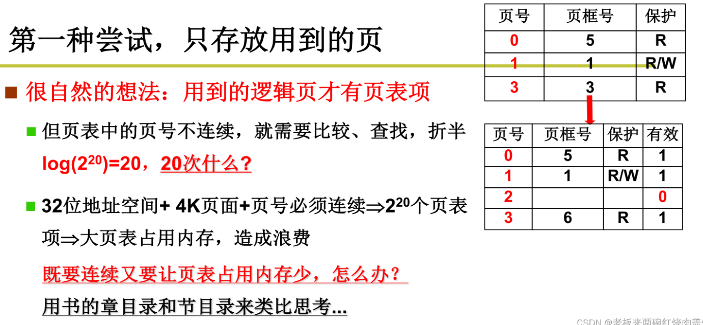
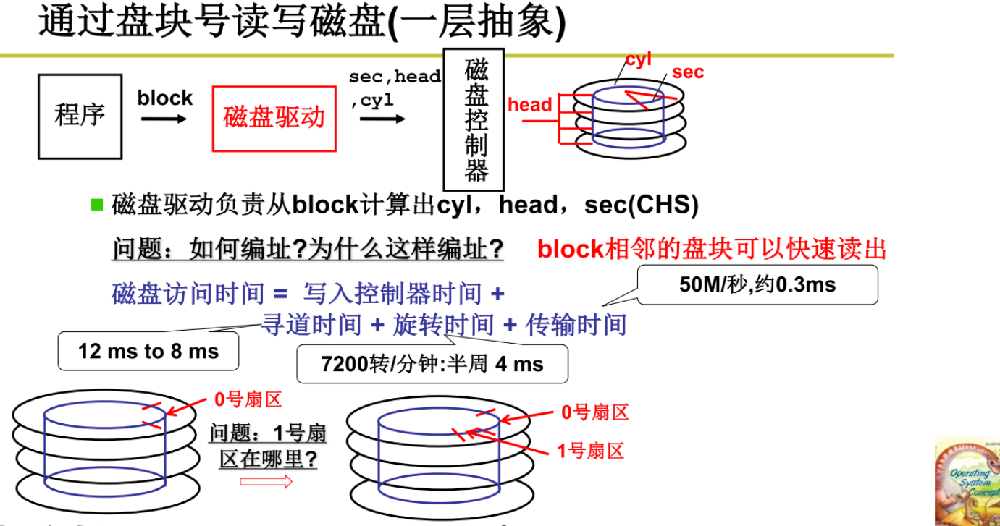

#操作系统 2
>[操作系统 李治军 网课](https://www.cnblogs.com/Baiyug/p/16544906.html)

>[笔记参考](https://blog.csdn.net/weixin_44673253/category_12014667.html?spm=1001.2014.3001.5482)

>[linux源码解析](https://www.cnblogs.com/Baiyug/p/16526902.html)

---

##3.1 内存使用与分片

使用内存：程序放到内存中，取址则从内存中去取，然后让程序执行起来

* 这是一个C程序，那么C程序编译成汇编了，里面的标号偏移是从0开始的，例如_enrty是0，_main的偏移是40
* 这段程序被放入内存后，为了让他正常工作，直观想法就是按照偏移放到物理内存的对应位置，这段程序也就必须放到物理内存的0地址处
* 问题：0地址是随便用的吗？ 一般0地址是操作系统用的，0地址一般不是空闲的；难道所有的程序加载进来都要放到0地址吗？那不就冲突了吗？
* 应该找一块空闲的内存放进去，例如放到1000的位置，但是这个时候地址就对不上了，怎么办？

####重定位

* 偏移应该变为相对地址，也就是逻辑地址，如40并不是真实内存地址，而是相对基地址的偏移40个单位
* 若是编译时重定位，一次编译后，内存地址就固定了，那么还是有可能存在冲突的问题，编译时无法预测哪一段内存是空闲的

* 如是载入时重定位，在载入的时候，将程序中的全部地址加上一个偏移，对应当前内存中的空闲空间，载入只有一次，但是一些情况下，载入后的程序还可能需要移动在内存中的位置，例如操作系统为了合理利用内存，程序载入内存后，如果进入阻塞或者睡眠，很可能会被交换到磁盘上，临时给别的程序腾出空间，再交换回内存后，不一定是原来的位置了

最好的方法——==运行时重定位==

* 在运行每条指令时才完成重定位，每执行一条指令都要从逻辑地址算出物理地址：地址翻译，也就是说，指令无论放到哪里都可以，根据这里的地址才能找到实际放到哪里
* 不需要去修改程序中的地址，而是动态的去翻译这个地址为物理内存地址
* 每个进程有各自的基地址，放PCB中，这个base会随着交换而被PCB进行记录，都是从PCB中找到这个基址，再加上逻辑地址，从而找到这个真实地址
* 对应的有相应的基地址寄存器，专门用来存放基地址，硬件加速；在进程切换的时候，会将PCB中的基地址放到基地址寄存器中，那么之后这个进程执行的每条指令的寻址，都会加上这个基地址

由于一整个程序是相对大的，有没有可能只在内存里载入程序中需要运行的一小段？——==分段==

* 每个段内的逻辑地址都是从0开始的
* 引入段后的地址定位：==<段号，段内偏移>==

* 如栈是可以动态增长的，如果空间不够了，那么栈段可以单独的再重新分配，而不需要给整个程序的数据重新分配
* 寻址要用段地址+段内偏移
* PCB中需要存放所有段的地址

* 课程刚开始讲引导的时候，提到的GDT表，就是操作系统这个进程的进程段表，而其他进程的进程段表是LDT表
* 进程切换的时候需要切换LDT表，进程寻址是到LDT表中查出段基址
* 操作系统进程放在GDT表当中，每个进程有自己的LDT表，在进程切换的时候，要LDT表进行切换，LDT表一旦切换，在每次进行地址翻译的时候，根据LDT的段号再找到数据段代码段的基址，即可找到物理地址

##3.2 内存的分区和分页

内存如何分割：

* 第一步，编译时，就将程序分成了多个段
* 第二步，找到若干块空闲的内存区域，用于存放多个段
* 第三步，将程序的各个段从磁盘中载入到找到的空闲内存区域中，并初始化LDT表，与PCB关联起来

* 固定分区，就是等分成k个分区，但是固定分区不合适，程序有大有小，会造成内存利用率低

* 可变分区，有空闲分区表和已分配分区表，根据这两个表就可以确定每个段放入到内存的位置

* 可变分区有三种适配方式
* 最佳适配：选择长度最接近请求长度的放得下的空闲内存块，当前例子中，选择（200,50），所以这是每次挑小的割。产生非常小的内存碎片，剩下的空闲内存块中，有的特别大，有的特别小
* 最差适配：选择长度最长的空闲内存块，当前例子中，选择（350,150），所以每次是挑最大的割，复杂度是O(n)。空闲内存块会比较均匀的减小，剩下的空闲内存块的大小都比较均匀
* 首先适配：选择第一个，或者随机选一个，不需要比较所有的然后挑出一块，比较快，时间复杂度O(1)

* 该题选B

引入分页：解决内存分区导致的内存效率问题（不采用分页还是会有一段一段很多的内存碎片被浪费）

* 把程序的段分成1页1页，物理内存在系统初始化的时候也已经被分成了1页1页，每一页就是内存单位，所以就减少了很多碎片
* 以4k为单位分割内存，每4k就是1页，在页的内部，每个段最多浪费4k（<4k）的空间
* 针对每个段内存请求，系统1页1页的分配给这个段，如上述的某个程序的一段——段0，将它切为4页，并分别存在页框5、1、3、6中

* 还是jmp 40;这个40被分配到哪一页上了呢？答：分到了第0页，因为段是从0页开始存放的，40地址是从零开始的40，再转换成物理地址，假设一页长度100，页0的页框为5，那么物理地址就是$5∗100+40=540$
* 之前是用段表重定位，现在是用页表，每个进程有自己的页表
* 页表索引寄存器cr3（之前的段表索引寄存器是ldtr），同样的，PCB关联了页表（有指向页表的指针）
* 例如0x2240，除以4K（右移12位，也就是0x2240的后三位搞掉，因为这是16进制数）的结果是0x2，这个值也就是页号，余数是0x240，这个值也就是偏移地址OFFSET，0x2作为查询页表的索引（页号），查到页框号是3，3∗4K（3是代表页框号）（就是3左移12位），再和余数拼起来，物理地址就是0x3240

##3.3 多级页表与快表

为何要涉及多级页表？

为了提高内存空间利用率，页应该小，但页小了页表就大了，维护和查询页表的开销就大了，页面尺寸通常为4K，地址是32位的，那么就会有$2^{20}$个页面，意思是每个进程都要维护$2^{20}$个表项的页表,需要1M个页表项，每个页表项一般需要4个字节，所以页表的总大小是4M，所以每个进程是4M内存，10个就是40M

* 一个进程有时不仅要加载代码本身，还会加载数据，那么为了利用所有内存，所以页表必须包含所有内存，也就是即使内存有块区域没有利用，但也得在页表中包含和表示出来

####尝试只存放用到的页

* 这样子虽然减少了内存占用，但只有用到的逻辑页才有页表项，页表中的页号就不连续了
* 页表的逻辑页号如果只保存用到的表项，那么就是不连续的，那么在查页表的时候，就必须使用查找算法，时间复杂度不再是O(1)的，这样做显然是不合适的，指令的执行效率大打折扣

####多级页表

* 多级目录，第一章第二章之类的，先找章再看节，就不用一节一节看过去，而且仍然是连续的，内存中只需要放当前用到的那一部分页表
* 现在只需要拿到第一章第二章等的章标题，再拿到第五章的节标题，也就是说，只要拿到前四个页目录项，以及第五个目录项对应的页表1个，这样在内存当中占的就少，既连续了，也保证内存小了
* 之前说高20位是页号，现在多级页表中，高10位是页目录号，次高10位是页号，低12位是页内偏移
  * 顶级页号10位，则顶级页目录有$2^{10}$个表项，每个表项4字节，顶级页目录共占用4K，正好是一页
  * 每一个顶级页内部，包含$2^{10}$个二级页，每个表项4字节，则每个二级页目录也占用4K，正好是一页
>  4KB = $2^{12}$bit
* 顶级页目录中，指向的二级页目录即使没有用到，这个表项也会存在于顶级页目录中，这样造成的空间浪费是小于4K的
* 顶级页目录中有效的表项指向的二级页目录会被加载到内存中，二级页目录包括的页即使没有用到，这个表项也会存在于二级页目录中，这样造成的空间浪费也是小于4K的
* 如上图的例子中，顶级页目录中，共有3个表项是有效的，分别指向3个二级页目录，顶级页目录+3个二级页目录共占用4∗4K=16K的空间，远远小于原先需要的4M；这3个二级页目录共管理了3∗$2^{22}$=12M的逻辑地址空间，当然其中也有一些空间没有用到，细究的话真实使用的逻辑地址空间肯定没有12M
* 顶级页目录的前两个表项是在低地址空间，后一个表项是在高地址空间，对于这种不连续的逻辑地址的使用也是完美处理的；也就是说，程序可以使用不连续的逻辑地址空间，但是多级页表仍然是连续的，查找的时间复杂度是O(1)的

####快表（TLB）

* 快表非常快能找到逻辑页对应的物理页
* 分段->分页->多级页表->快表

* 多级页表增加了访存的次数，每一级访问一次内存；每访问一次内存，需要额外访问页表级数次的内存
* 如果是64位情况下呢？肯定需要更多级的页表，那么访存次数也就更多,所以多级页表的解决方案仍然会有时间复杂度的增加
* TLB是一组相联快速存储（快表），是寄存器，可以看成是页表的高速缓存
* TLB是硬件，所以可以存储少量的不连续的表项，查询速度很快
* TLB保存最近访问的逻辑页号和物理页框号的对应关系

* 命中直接TLB（表越大，命中率越高）
* 未命中直接TLB之后再多级页表

####内存访问的空间局部性

* 局部性：刚访问的经常再访问，而且它旁边的也容易很快被访问，所以TLB条目数不需要很大，只需64到1024之间

##3.4 段页结合的实际内存管理

####段和页结合的媒介——虚拟内存

* 程序员希望用段（如代码段、数据段等）来更加直观地管理内存，物理内存希望用页来管理内存以增加内存使用率
* 分段：代码分段+内存分区+段表
* 分页：内存分页+（多级）页表
* 两者组合，让前者内存分区的输出作为后者分页的输入
* 应用程序有代码段，首先在虚拟内存当中割出一块区域给这个段，然后在操作系统当中虚拟内存的段，再打散成一页一页，然后再和页关联在一起，所以现在用户的代码段已经放到了内存里
* 值得注意的是，虚拟内存并不是真正的内存，不占什么空间，里面存储的只是段的地址

* 用户程序所指出的==逻辑地址==（CS：IP）先查询虚拟内存的段表，得到==虚拟地址==，虚拟地址包括页号和偏移，根据这个查询页表，得到物理内存中的页框号，从而求出==物理地址==

* 程序载入内存：首先，使用之前内存分区中讲得分区适配算法，对虚拟内存进行分区，对程序的各个段进行适配，建立段表；然后，对虚拟内存占用的空间进行分页，分配物理内存的页，建立页表，同时程序也就载入了内存
* 整个过程分为五步
  *  在虚拟内存当中割一段出来
  *  把用户代码放进虚拟内存——即建立段表，明确映射关系
  *  对段进行分页，再在物理内存当中，找到相同数量的空闲页
  *  建立页表，再加上真正的磁盘读写就能把代码真正转移到物理内存当中
  *  用重定位来使用内存

####代码实现

1. copy_mem()

* 在fork一个新的进程的时候，在copy_process中，调用了copy_mem
* copy_mem，nr是进程的编号（第几个进程），p是PCB
* new_data_base就是每个进程在虚拟内存中的起始地址，每个进程占64M虚拟地址空间，互不重叠，给new_data_base赋值就是在虚拟内存中分区
* set_base就是在设置段表基址（段表中存放着每个段对应的基址），在这里的实现中，数据段和代码段是同一个段，这一步就是在建立段表
* 在这里只是简易的实现，由于所有进程的虚拟地址互不重叠，所以所有进程可以共用一套页表；但是现在的操作系统，进程的虚拟地址是会重叠的，所以每个进程应该维护自己的页表

2. copy_page_tables()

* copy_page_tables，子进程和父进程共用物理内存的页，所以子进程实际上不需要新分配内存，直接建页表即可
* 实参old_data_base对应形参from，表示父进程的虚拟内存的起始地址，from右移20位，和0xffc进行位与，结果赋给from_dir
  * 右移22位，得到了页目录号，再乘以4，得到顶级页目录中的索引位置（顶级页目录中的每一项占4字节），所以代码里直接写了右移20位
  * from_dir就是指向父进程的第一个二级页目录的指针，*from_dir就是父进程的第一个二级页目录
* 实参new_data_base对应形参to，表示子进程的虚拟内存的起始地址，to右移20位，和0xffc进行位与，结果赋给to_dir
  * to_dir就是指向子进程的第一个二级页目录的指针，*to_dir就是子进程的第一个二级页目录
* size表示有多少个二级页目录

* 循环size次，给子进程的二级目录分配页
* get_free_page()使用内嵌汇编从真实的物理内存中取出一空闲的页，这一页是用来存储页表信息的，并不是存储具体代码数据的，因为页表也需要存在内存中，也需要向内存申请一个空闲空间
* 在这段代码中，为物理地址to分配新的物理内存是因为该函数的目的是将一个页表从物理地址from复制到物理地址to，并且在复制过程中会修改该页表对应的页目录项，使得该页目录项指向新的页表。因此需要为物理地址to分配新的物理内存，用于存放复制来的页表数据。

* 按照父进程的每一个二级页目录，建立子进程的每一个二级页目录，里面存着的就是物理内存地址
* mem_map[this_page]++，有点像引用计数的概念，两个虚拟内存页共享一个物理内存页

* 进程1为父进程，fork得到进程2子进程，它们的虚拟内存指向了同一块物理内存空间，但虚拟地址不同，页号和偏移也不同

1. 重定位

* 段表、页表建立之后，就可以使用它们进行地址翻译了
* 子进程进程2的*p=8，是进行写操作，由于在根据父进程建立子进程的二级页目录时，进程2对对应物理页内存的权限是只读，所以不会改变这个物理页内存上的数据，而是找到一个空闲的物理页，写上8，再将二级页目录里面的页地址改为新的页地址
* 如此，两个进程的内存数据也就不会相互影响了，相当于实现了内存的隔离

##3.5 内存换入——请求调页

* 实际的计算机中往往虚拟内存和物理内存的大小不一样，这时候就需要分批将虚拟内存中所代表的数据载入到物理内存中
* 例如此时计算机需要运行左边红色块中的代码，则将这个红色块载入到物理内存中，而下一时刻要运行右边红色块的代码，此时又要把这个红色块载入到物理内存中
* 就好像虚拟内存是仓库，物理内存是店面，只要你上架下架的速度足够快，店面里就会有你想要的商品
* 总有程序数据超过物理内存的时候，gta5一开，能把60g全加载到内存上？不可能，必须涉及虚拟内存和换入换出

* 实现换入的核心——请求调页
* 计算机中的硬件发现地址所在的页不在内存中，则产生缺页中断，请求调页，从磁盘中读出数据放入内存中，并更新页表

* 选C

####具体代码实现

* 从缺页中断开始，得先设置中断，系统初始化的时候，就在IDT表中初始化好了中断的处理代码

* cr2这个页错误地址就要放到寄存器当中

* 形参address就是引发缺页中断的地址
* address&=0xfffff000;计算得到页面地址
* get_free_page()，分配一页物理内存、
* bread_page()，从磁盘中读入数据到刚分配的页中，bread=block read
* put_page()，更新页表，加入刚读入的页与虚拟内存之间的映射关系
* get_empty_page()，将一个计算得到的结果保存到某个地址，这个地址属于之前还没载入的页，而且这个页上并没有程序本身的数据，不需要去磁盘载入，所以就可以直接分配一个空的页，并更新页表

* 更细页表
* 右移12位是为了去掉页内偏移，再与3FF与是为了只保留页号。然后以页号作为索引在page_table找到这一页对应的条目
* 然后就可以将page_table对应的位置更新为新的物理地址page

##3.6 内存换出

* get_free_page()是换入的时候得到一个物理空闲页，并不是总有新的空闲页，因为内存是有限的，所以必须要选择一个页换出去，也就是写出内存，写入磁盘中
* 把哪一页从内存当中换到磁盘上，腾出内存来，换入别的页，所以需要选择一页淘汰，换出到磁盘，本节讨论的算法就是应该选择哪一页换出

####FIFO

####MIN

* D要换入，而C是未来最久远才被使用到的，所以选C换出再D换入
* 这是个理想算法，操作系统做不到，但可以近似想这个最优来靠近

####LRU

* D要换入，而C是之前最久远被使用了的，所以选C换出再D换入

* 维护一个全局时钟，每页维护维护一个时间戳，表示这一页的最近使用时间
* 选择最近使用时间最早（最小）的页淘汰，所以把上述的D把C给换掉了
* 每执行一条指令的时候，就要把页的时间戳进行修改，算法实现很简单，但是需要遍历找到最小值，时间复杂度较高，不可行

* 新来的页，如果栈空间还够，就加到栈顶
* 新来的页，如果栈空间不够，则淘汰栈底元素，新来的加再加入栈顶
* 已有的页，从栈里原来的位置移到栈顶
* 从栈顶到栈底，是按照最近使用时间戳从大到小的顺序排列的
* 时间复杂度仍然不低，所以实际操作系统不用这种算法

####SCR算法/clock算法

* 每个页加一个引用位
* 每次访问一页时，硬件自动将这个引用位设置为1，代价较小
* 需要淘汰页时，扫描每一页的引用位，碰到1则置为0，碰到0则淘汰该页（注意这里的1，代表的是访问过的意思，碰到1就是最近访问过，0就是没访问过，所以碰到1的话，再给你一次机会，置成0，如果转了一圈发现你还是0，就是最近没访问过，那么就要被淘汰了，因为又转了一圈，发现你是没访问过的（最近没有使用），那么根据LRU，肯定是要被淘汰的）
* LRU是最近最少使用，这种算法是最近没有使用

* 如果缺页很少，那可能会出现所有的R=1，很少出现从1置成0的情况，那么下一次缺页的时候，需要淘汰页，那么需要扫描一圈，把所有的1置为0，然后才能把第一个全是0的页淘汰掉
* 如此循环，那么每次扫描都需要扫描几乎一圈，那么下一次淘汰页，从下一个位置开始扫描的话，淘汰的就是下一个位置的页
* 在这种理想情况下，退化为了FIFO
* 本质原因：在缺页很少的情况下，历史信息一直没有被清零，记录了太长的历史信息，就无法反映出“最近”这段时间的情况
* 解决办法：定时清除标记位，再加一个扫描指针用于清除，这个指针移动速度要快一些，很像一个时钟，应该定时清除R位，让R位从1置成0
* 增加一个速度更快的扫描指针，定时清除R位

####另一个换出的问题：如何给进程分配页框的数量

* 系统内进程增多的时候，每个进程分到的页就少了，每个进程的缺页率就增大了，缺页率太大，那么总是要缺页中断，页换入换出（磁盘读写IO），刚把某一页换出去，又把这一页换进来，CPU利用率就降低了
* 那么每个进程到底应该分配多少页框？根据局部性原理，一个程序在某一段时间内，用到的数据具有空间局部性，如果页框的数量可以覆盖住这个局部空间的大小，那么就是足够的
* 可以动态的调整分配给进程的页框数量
* 但是当进程数增大到一定程度的时候，每个进程分配到的页框数量必然是不够的，这个时候就应该限制进程的数量

####总结

* 在安装linux的时候，都需要在磁盘上分配一个swap分区——系统就是在这里进行内存换入换出的
* Swap分区在系统的物理内存不够用的时候，把硬盘内存中的一部分空间释放出来，以供当前运行的程序使用。那些被释放的空间可能来自一些很长时间没有什么操作的程序，这些被释放的空间被临时保存到Swap分区中，等到那些程序要运行时，再从Swap分区中恢复保存的数据到内存中

##4.1 I/O与显示器

* 操作系统整体框图

* 操作系统控制外部设备：CPU向外设控制器中的寄存器读写数据，控制器完成外设的工作，并向CPU发中断信号，总的来说就是给外设的控制器当中的存储器/寄存器写东西，发一个指令，然后控制器就会处理
* 实际上那么多代码的核心就是out xx, al这样的指令，外设的那些控制函数就是将out指令包装起来，对用户更加友好
* 需要查寄存器地址、内容的格式和语义操作系统要给用户提供一个简单视图，即==文件视图==（操作系统两大视图之一，还有一个是系统视图），这样方便，因为无论使用什么样的显卡，到操作系统上都是printf("xxx")，所以最终就是形成一个统一的接口

> 用户视图
> 
> 计算机的用户视图是指正在使用的界面。此类系统旨在让一个用户独占其资源，以最大限度地提高用户正在执行的工作。在这些情况下，操作系统主要是为了易用性而设计的，对性能有一定的关注，而对资源的利用没有重视。

> 系统视图（多进程视图）
> 
> 操作系统也可以被视为资源分配器。计算机系统由许多资源（如硬件和软件）组成，必须对其进行有效管理。操作系统充当资源的管理者，在冲突的请求之间做出决定，控制程序的执行等

~~~c++
fd open (/dev/xxx");
for (int i = 0; i < 10; i++){
	write(fd, i, sizeof(int));
}
close(fd);
~~~

* 不论什么设备都是open, read, write, close
* 操作系统为用户提供统一的接口
* 不同的设备对应不同的设备文件(/dev/xxx)
* 根据设备文件可以找到控制器的地址、内容格式等等

* open，read，write，close之类的命令，根据文件名来找到对应的硬件再进行处理
* 做完了就用中断处理，再回到文件视图里
* 中断处理：键盘获得了输入字符，放到缓冲区，通知cpu取数据
* 响应设备中断的 ，比如按下键盘k，就把键盘寄存器里存的按下去的键的映射给操作系统进入内存

###显示器输出具体实现

####sys_write()

* 无论访问的是什么设备，都是从文件接口开始，也就是==系统调用==那部分说过，write(1, buf)就是落实下来就是out指令，设备虽然不同，但是接口都是read，write
* write通过系统调用，通过int 0x80到了内核里面，执行的就是sys_write
* write(1, )这个1很重要，1决定了是往显示器上写，对应的形参是int fd，fd是文件描述符，0:标准输入，1:标准输出，2:标准错误
* current就是当前进程，这个数组的第一项就会赋值给文件file
* 1这个地方对应了一个文件，实际上是1这个地方打开了文件
* inode就是这个文件存放在磁盘上的一些信息
* 1是从PCB来的，而PCB是fork()创建的时候，即拷贝父进程来的，即copy_process()

* filp[i]是打开文件的指针，filp——file pointer
* ++操作的对象是被操作的文件，目的是文件信息更新（使用者加一）
* init()中打开了这个文件，并且拷贝了两份，dup(0)
* tty0是Linux系统中的一个虚拟控制台，它可以通过按下CTRL+ALT+F1键来访问。在Linux系统中，通常有6个虚拟控制台，分别为tty1-tty6，而tty0则代表当前显示器所在的控制台。当用户切换到tty0时，屏幕上会显示一个登录提示符，用户可以在此输入用户名和密码以登录系统。tty0通常用于启动系统、调试和故障排除等操作
* open函数调出sys_open函数

* open就是形成如上这条链
* 使用open_namei函数把filename对应的文件打开，并把其文件信息赋值给inode
* 创建一个f，该文件放在file_table中，并将f与该进程PCB的flip的一项相关联，那么f就可认为是filename对应文件的一个句柄
* 接着将filename对应文件的各种信息数据（包括inode）赋值到f中去

* 继续看sys_write
* S_ISCHAR——判断是否是字符设备（计算机通常分为字符设备以及块设备）
* rw_char就是读写，inode有一个字段存放这个设备到底是第几个设备，i_zone[0]就是给出的char设备号，在此处是4
* 接下来就转进rw_char函数，crw_table表里面存放的是函数指针，根据这个函数指针，就可以获得第几个字符设备对应的处理函数

####crw_table

* (rw==RED)?——判断是读还是写设备，终端设备是显示器就是写的，键盘就是读的
* 接着转到tty_write

####tty_write()

* tty_write函数定义在tty_struct中，在其初始化的时候就定义了con_write函数，即控制台写函数
* con_write是真正的开始写显示器
* ax由高8位ah和低8位al组成，al当中是数据，然后ah当中是属性
* 然后mov ax, pos，就把要显示的字符的内容和属性放到ax中
* 若外设控制器是统一编址的则用mov，独立编址的则用out

####pos的修改

* 初始的pos看con_init，里面有两个参数，然后通过这两个参数可以把pos计算出来
* 90000和90001，这就是第一节课当中的bootsect.s把自己和setup.s移动到内存0x90000处，里面存储着光标的初始位置信息
* 使用gotoxy算出下一步的光标应在的位置，以便在此处打印字符

####总结

##4.2 键盘

* {set_trap_gate(0x21, &keyboard_interrupt);}这里就是将0x21设置成这个键盘中断
* inb是读入一个字节，相应地也有outb
* inb指令端口0x60读入扫描码到al也就是ax的低8位中
* 所有的键盘，每一个按键都对应一个码
* 然后根据不同的码，来调用一个table——key_table来执行相应的函数

* 按下常见的字符会调用do_self函数，按下F1、F2这种就调用func函数
* 在do_self中会将key_map载入到ebx寄存器中

* key_map中存入的都是ASCII码，也就是之前的可显式字符
* 这个表的起始地址已经赋给了ebx(lea key map, %ebx);，再加上刚才的扫描码，扫描码对应的是这个表的偏移，将两个组合起来movb (%ebx,%eax), %al，就能找到你按下的这个键所对应的ASCII码赋给al
* 得到ASCII码之后将其放到缓冲队列(call put_queue)

* put_queue函数就是将刚刚按下的按键对应的ASCII码放到read_q队列中，上次是write_q现在是read_q
* 接下来要在显示器上打印出键盘按下的字符，即回显——copy_to_cooked
* copy_to_cooked中还对字符做了一些处理，接着将read_q里的字符再放入到一个叫做secondary的队列里，最后的字符显示就是从secondary队列中取出药显示的字符

####总结

* 按下按键发生中断
* 取出ASCII码放到read_q里
* 经过转译放到secondary（这里才是scanf真正取的）
* 之后回显write_q（回显的时候调用con_write即可回显）

* 最后将显示器和键盘和操作系统串在一起
* 形成文件视图

##4.3 生磁盘的使用

操作系统与磁盘的框图如下

####磁盘的结构与I/O过程

* 磁盘的机构为：柱面->磁道->扇区
* 一个柱面含有若干个盘面，一个盘面有一个磁道，一个磁道由若干个扇区

* 读/写一个字节，具体的操作如下
  * 首先将磁头移动到指定的磁道上
  * 然后磁道开始旋转
  * 转到相应的扇区开始位置以后，再转动以扫描整个扇区
  * 磁生电的时候，磁信号就变成电信号，然后就读回去了，也就是读到内存的缓冲区当中
  * 读到内存的缓冲区后 ，再将这个内存缓冲区修改一个字节，然后再到里面转，再电生磁，把这个字节写进去

####最直接的使用磁盘方法

* 程序输出要读/写的磁盘的位置，也就是输出该位置在磁盘中的三维坐标(柱面，磁头，扇区)，也就是(cyl,head,sec)
* 接下来就可以利用DMA技术利用总线传输数据，将磁盘扇区上的数据放到内存上，或者将内存的数据写到扇区上
* do_hd_request就是申请读/写磁盘
* hd_out就是输入要读/写的磁盘的具体位置后，将其发送给磁盘控制器
* port_write就是将已经在内存缓冲区的要对磁盘写的数据发送到串口上

####通过磁盘号读写磁盘

* 为了更简便地确定磁盘的具体位置，使用盘块(block)，计算机会自动利用磁盘驱动将盘块号转为上面所讲的三维坐标
* 通常一个盘块由相邻的若干个扇区组成，在linux 0.11中一个盘块包含两个扇区，这样是为了能够更快速地读出数据，而且通常程序都是存储在相邻扇区的，这样子计算机一读一个盘块，就把几个扇区的数据全都督导内存里了，比逐个扇区一一读出更省时间

* 根据磁盘旋转读写数据和磁头垂直线性运动的固有特性，扇区的排布按照上图更加合理，节省出不少运动的时间
* 扇区越大，计算机一次读操作能够读出的数据越多，那么就象征着读写速度越快，但是这样会导致空间利用率下降，这两者应该折中处理
* Sectors: 总扇区数，Heads: 总磁头数；C: 目标柱面，H: 目标磁头，S: 目标扇区
* 上方的公式当中，第一项是一个完整的柱面包含的扇区数，第二项是前H个磁头包含的扇区数，最后加上S个扇区就是block了，通过公式 $block \% sectors = S$就可以算出S，其余的以此类推

* make_request函数申请访问磁盘，req->sector=bh->b_blocknr<<1就是把请求访问的盘块号除以2得到此盘块对应的开始的扇区号，这也说明了linux 0.11的盘块由2个扇区组成
* do_hd_request就是处理盘块号，根据盘块号计算出三维坐标——sec、cyl和head，最后hd_out将其发送给磁盘控制器

####多进程使用盘块

* 当多个进程都要访问磁盘时，他们所请求的盘块号会发送到请求队列中，每次都从队列中拿出一个，之后的处理和前面的相同
* 那么取出队列中的哪一个盘块？这时候就要调用调度算法

1. FCFS

* 先入先出
* 但磁头运动过多，浪费时间较多

2. SSTF

* 先处理距离现在磁头位置最近的请求
* 但是会造成远距离的请求等很久，产生饥饿问题

3. SCAN

* 扫过去再扫回来
* 但是中间的请求还是会被优先处理，饥饿问题仍存在

4. 电梯算法

* 电梯只有一个方向，走到头了立刻复位，复位过程不带人
* 多进程通过电梯算法将自己的的请求放在队列当中

* 在add_request中的红色if判断程序中对新进来的盘块，根据电梯算法，插入到队列中的合适位置
* IN_ORDER语句：当s1比s2盘块号小时返回true
* tmp是对队列中的各个盘块号进行遍历，当发现新进来的盘块号req比tmp大，而比tmp下一个盘块号小时，则插入他们中间
* 或是发现tmp比req大，但req比tmp下一个盘块号大时，也插入他们中间

####总结

##4.4 从生磁盘到文件

* 普通用户使用生磁盘，还需要盘块号，所以很不方便，所以OS引入更高层次的概念-文件，有了文件后，用户再使用信息就变得更加直观自然
* 核心：从文件得到盘块号，建立映射关系

####连续结构实现文件

* 使用连续结构来实现文件
* 举个例子，我们有个名为test.c的文件，由于连续结构，它被安排存在磁盘的6、7、8号盘块中，我们想要修改test.c文件中的200-212字符，那么假设一个盘块可存储100个字符，则200-212字符应该第8号盘块中，再根据偏移量0-12，我们就可以定位到他在磁盘中的位置
* 可创建文件控制块FCB，里面存有test.c的起始块——第6号盘块，和块数——3
* 增加到一定的时候，装不下了，要去到更大的空间，就很慢，这就是连续结构的缺点，连续结构实现适合顺序读取，不适用动态增长

####链式结构实现文件

* 链式结构的FCB记录下起始块，然后找到第1号盘块，里面还存有下一个盘块的编号——10，接下来就找到了第10号盘块，以此类推。。。-1表示它就是最后一个盘块了
* 链表更加灵活，但是是顺序存取，每次都得从起点开始读取

####索引结构实现文件

* 单纯拿出一块空间来做索引，通过索引块（目录）找到其他块（数据）
* FCB中存有索引快的盘块19，第19号盘块号里统一且按顺序存储了每一个存有数据的盘块，-1表示并没有被使用
* 查找速度很快

####多级索引实现文件

* 实际操作系统中根据文件大小各异的特点，利用多级索引来查找文件
* 这里的inode就是上面的索引块
* 当文件很小时，索引块就是数据块，可实现非常高效地访问
* 当文件中等大小时，具有一阶间接索引，它其实就是索引块，与上面的方法一样
* 当文件很大时，则采用二阶甚至三阶索引，第一层索引块中存储的是第二层索引的位置，以此类推

* 答案选A
* 因为词典的内容是基本不变的，故其不会动态增长，从而其位置不会改变，为了高效查找，故采用顺序结构

##4.5 文件使用磁盘的实现

####sys_write()

* int fd是文件的描述符
* char* buf是内存的缓冲区
* int count是读写字符的个数
* inode就是FCB
* 与前面的显示器显示一样都是使用这个函数，但是显示器进入的判断是S_ISCHR，就是字符设备，而这里是S_ISREG，表示的是常规文件
* 接着便进入file_write函数

####file_write()

* 如何得到200-212区间的字符的？在于文件读写指针的处理，在file里面有一个f_pos，这个f_pos就是读写指针，这个读写指针就是字符流当中的位置，也就是200，把这个读写的位置交给pos就完事了
* 至于212，那么就看count，count肯定是12，这样就得到了字符流的读写位置
* 另外当是在文件末尾追加字符串的时候(O_APPEND)，pos则应该就是文件的大小，这样就定位到了文件最后的位置
* 在while循环里面，create_block函数用于找到对应的盘块号，若找不到，则新创建一个
* bread读取该盘块下的数据
* 接下来的pos+=c是更新接下来要写入的位置
* get_fs_byte是从用户空间读取数据并写入数据块中，这里就是将对应位置的内容修改为buf里的内容
* brelse释放数据块
* flip->f_pose=pos更新一下最后的位置

####create_block()

* create_block函数就是当形参create=1时候的_bmap函数，其作用是当存在该盘块时返回该盘块的编号，否则新创建盘块再返回盘块号
* i_zone是在inode（FCB）当中的索引项
* 如果block < 7直接对应的就是数据块
* block -= 7，比7大就得减去，到了一重间接
* 当block还大于等于512时，进入二重间接，即二阶间接索引

####m_node

####文件视图总结

* 什么叫打开文件——fd = open("test.c");？就是从文件名到inode的映射
* 前面的课讲了文件视图的两条路，一条是读写磁盘，就是打开常规文件，另一条是输出到显示器，就是打开字符设备文件
* 这也在sys_write中有所体现，在不同的if判断里有种不同的写函数，读写磁盘是file_write，输出到显示器则是rw_char
* 但两者很多相同点，都是经过write函数后再PCB的flip数组中找到相应的文件，接着找到对应的inode
* 之后就是不同的地方，一个是写在磁盘里，一个是写在显示器中

##4.6 目录与文件系统

* 将整个磁盘的盘块存储映射关系维护结构使得在用户眼里形成一堆有组织的文件（树状的目录树）
* 文件系统：将整个磁盘的盘块最后抽象成目录树结构
* 目录树：用户使用磁盘的基本样子，用户不关心磁盘有什么，插在哪里，怎么运做的，只关心这个磁盘里有哪些文件，分别放在哪些目录下

* 开始的时候并没有目录树的概念，而是直接将所有的文件放在一起，只有一层结构
* 对用户体验仍很不友好

* 引入目录树，这是典型的分治思想

* 上节课当中，a是字符流，已知a的inode（FCB）就可以找到这个文件（一旦知道inode就知道映射表了，再根据字符流的位置，就可以读写文件）
* 但是FCB也不小，要把所有与my里面的文件的FCB全都读进内存，再一一比较FCB中的文件名字找出data文件吗？这样子的效率很慢
* 所以，只需在my中存储data、cont、mail的FCB的==地址==即可，这样通过地址就可以找到FCB，效率大大提高

* 目录树的完整实现如上
* 磁盘会划出FCB数组和数据盘块集合两个区域，FCB数组中统一存储所有文件的FCB，数据盘块集合中存有真正的文件数据
* 操作系统首先找到磁盘的根目录的FCB，就可以定位到根目录的数据块，数据块中存有var和my两个文件的文件名和其FCB的地址，如var的FCB位于FCB数组索引为13的地方
* 以此类推，就可以找到my的FCB进而找到my的数据块，接着找到data、cont、mail的FCB地址

* 以上是一个磁盘的分区情况
* 引导块是磁盘自带的
* 超级块就是linux系统中执行mount命令读取的块，其中存有i节点位图区和盘块位图区的大小
* i节点位图第一位肯定是根目录的FCB，它的位置可以由超级块存储的信息算出
* 数据区的起始位置也可以由超级块存储的信息计算出

####总结

##4.7 目录解析代码实现

####sys_open()

* 文件打开时会调用在sys_open函数，接着调用open_namei，接着调用dir_namei，接着调用get_dir

####get_dir()

* 首先判断输入进来的地址是否以'/'开头，若是则表示从根目录开始，否则从pwd即当前目录开始
* while里不断循环，一层一层进入，find_entry将读取到下一层目录项，并将存放到de中，如de中存有字符串"var"和inode索引号13
* 将inode索引号赋给inr
* 接着使用iget函数读到var的inode，进入到下一层目录，也就是进入/var中

* 根目录的inode是什么时候获得的？是在系统初始化阶段就获得的，并且通过fork传递到子进程
* mount_root就是载入磁盘，将根目录的inode赋给了current->root

####iget()

* 在iget中进入read_inode函数
* 首先调用get_super获取超级块中含有i节点位图和盘块位图的信息，之后就可以计算出i节点块中相应的inode所在的盘块，计算公式如上红色子图计算block的部分给出
* 2是引导块和超级块两个盘块，然后加上i节点位图的盘块数量，再加上盘块位图的盘块数量，最后i_num就是索引号，将其减去1后再除以每个盘块含有inode的数量，就可以得出对应的inode所在的盘块的编号
* bread读入盘块数据，并将盘块对应位置的数据赋给inode

####find_entry()

* get_dir里面的find_entry部分如上，如根目录下有目录项<var,13>和<my,82>等若干个，怎么取到var
* 在while循环中调用match函数将目录项一个个比较，直到找到var并返回这个目录项

* while中还有些细节
* while中其实还要调用bmap，因为目录可能还是一阶间接或是二阶间接索引的，得用bmap层层解析获得盘块号

> 结束！